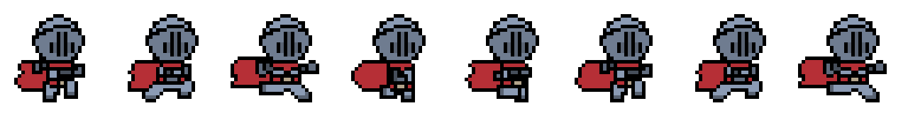

# Lesson 1.1: Creating and Importing Our Player
* before we begin coding in python/pygame, we must learn how the program is able to read animations

* pygame uses a **sprite sheet** - a single image that contains all the frames arranged in a row (it can also be in columns)

> <ins>Example</ins>: 
Let's say we have a character that can walk to the right. The walking animation would have 8 frames. In the **sprite sheet**, these frames would be arranged in a single row. Let's assume each frame is 64X64. This would mean the entire sheet would be 512x64 pixels (8 frames * the width of 64 pixels)

__Visual Example:__




> [!IMPORTANT] Please take a look at classes V:1.0.0:

```python
# Let's say our sprite sheet is loaded as an image
sprite_sheet = pygame.image.load("character_walk.png")

# Each frame is 64x64 pixels
frame_width = 64
frame_height = 64

# To get frame 3 (0-based index) from the first row:
frame_x = 3 * frame_width  # 192 pixels from the left
frame_y = 0  # First row starts at 0
frame_3 = sprite_sheet.subsurface((frame_x, frame_y, frame_width, frame_height))

```


## Let's Take a look
